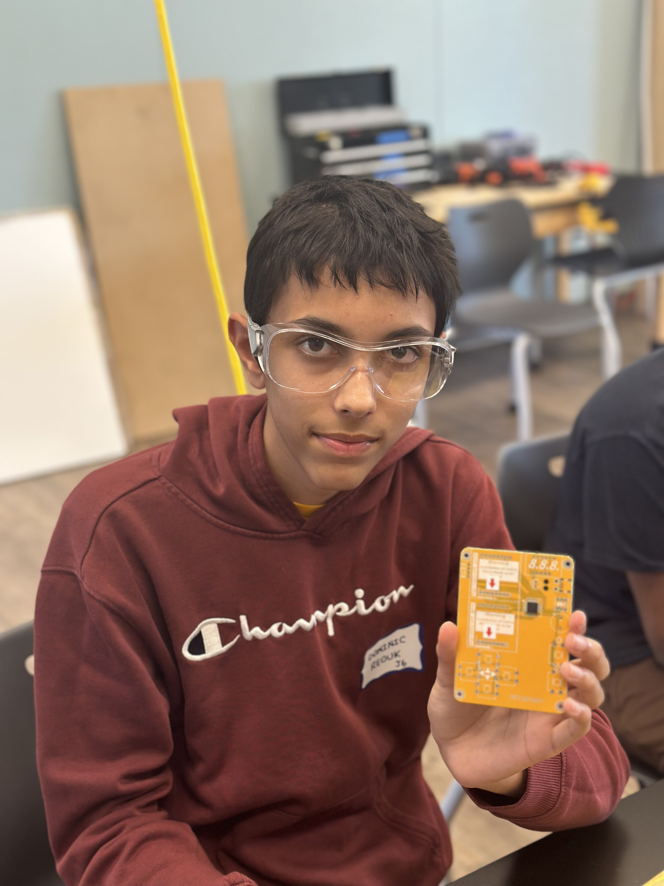

# Ball Tracking Robot Using Computer Vision
<!---
Replace this text with a brief description (2-3 sentences) of your project. This description should draw the reader in and make them interested in what you've built. You can include what the biggest challenges, takeaways, and triumphs from completing the project were. As you complete your portfolio, remember your audience is less familiar than you are with all that your project entails!
-->

| **Engineer** | **School** | **Area of Interest** | **Grade** |
|:--:|:--:|:--:|:--:|
| Dominic R | Mountain View High School | Software Engineering | Incoming Sophomore |



My name is Dominic Reouk. I live in Los Altos and am a rising sophomore at Mountain View High School. My favorite subjects are Math and Science, and the fields I'm interested in are Robotics, AI, and Software Engineering. In the future, I hope to work on robots that venture into space to collect data on otherworldly planets. In my free time, I like to read books, travel, hang out with friends, and play video games.

# Final Milestone (Coding the logic)

<iframe width="560" height="315" src="https://www.youtube.com/embed/F7M7imOVGug" title="YouTube video player" frameborder="0" allow="accelerometer; autoplay; clipboard-write; encrypted-media; gyroscope; picture-in-picture; web-share" allowfullscreen></iframe>

# Summary
From my second milestone, I've gone through an iterative process of reorienting parts around the chassis and coding basic logic for the robot to track the ball. I reoriented my breadboard and battery pack following the addition of the portable charger, which allows the robot to become wireless and ready for testing, and I also went through multiple orientations for the ultrasonic sensor and PiCamera. I learned how to use Pulse Width Modulation, a function to help control the speed of DC Motors, to my advantage so that the robot could turn at a slower speed to more effectively find the ball. Once my hardware was settled, I started coding some basic logic, but was stuck at turning the various ideas I had into effective code. As a result, I used the help of ChatGPT to make substantial changes, which allowed my robot to unlock smart/smooth steering and detect the ball more frequently. A few key topics I learned about during my time at BSE were soldering, breadboard connections, the power equation, Ohm's Law, PWM, and the oscilloscope. I understood different solder joints and which onces to avoid, how the underside of a breadboard looks like and how to use one effecetively, how to calculate the necessary resistance for a project using the power equation, how Ohm's Law (V = IR) ties into my project, how to use PWM to control the speed of DC Motors, and the usefulness of an oscilloscope for visualizing connections. After everything I've learned at BSE, I hope to use my knowledge in soldering and breadboard connections for competition projects within school clubs, and I hope to understand at a deeper level how to use the power equation and Ohm's Law in complex electrical projects.
# Challenges
One minor challenge I encountered was deciding what orientation of the PiCamera and ultrasonic sensor I would use. I went through multiple orientations, which involved assembling and subsequently disassembling the PiCamera Mount, since its angle made ball detection difficult. I ended up taking two ultrasonic mounts and using double-sided tape to fix the two objects in optimal positions for detection. One major challenge I had was that one of my motors suddenly stopped working one day, so I learned how to use an oscilloscope so I could identify the problem, which was that I was misusing PWM due to my primitive understanding of the function at the time.

# Second Milestone: Setting up Hardware and Electrical Connections

<iframe width="560" height="315" src="https://www.youtube.com/embed/SG6JKxGKYbI?si=zcIaGNO3x1XRtLHC" title="YouTube video player" frameborder="0" allow="accelerometer; autoplay; clipboard-write; encrypted-media; gyroscope; picture-in-picture; web-share" referrerpolicy="strict-origin-when-cross-origin" allowfullscreen></iframe>

# Summary
Since my first milestone, I have constructed my robot chassis and attached all my electronic components to it using a strong double-sided adhesive. I was able to successfully test my DC Motors and Ultrasonic Sensor using code I found on the official Raspberry Pi website. They contribute to the final goal since the motors will move the robot towards the ball. The ultrasonic sensor can identify how far away different objects are, including the ball. I also solidified my electrical connections by either soldering or wrapping wire around electrical points. Something surprising that has occurred was that I found some code for calibrating and sensing a certain color on **Seeed Studio**, and it worked perfectly without any problems at all. Normally, I have found that using code online to work on a project always has its own, unique kinks to work out, but the lack of those kinks surprised me. Before my final milestone, I have to create the main software for the robot, which entails creating a color mask for the ball and writing logic for the robot to track and move towards the ball.

# Challenges
One challenge from Milestone 1 that was able to be overcome was the loss of the SSH Key connection, and as I mentioned, the instructors created a new WiFi network that made handling the Pi much easier since I could use Tiger VNC, a better visualization software compared to OBS Capture. Although this milestone didn't bring up any serious challenges, a minor challenge that I faced was effectively attaching all my hardware components to the chassis, which I solved by purchasing a strong double-sided tape and sticking all my components to the chassis.

# First Milestone: Setting up Raspberry Pi

<iframe width="560" height="315" src="https://www.youtube.com/embed/qotKq9lGOao?si=t-YUARO0Oc2g_OL_" title="YouTube video player" frameborder="0" allow="accelerometer; autoplay; clipboard-write; encrypted-media; gyroscope; picture-in-picture; web-share" referrerpolicy="strict-origin-when-cross-origin" allowfullscreen></iframe>

# Summary
My project is a ball-tracking robot, which means that it needs some way to receive visual input and take action based on that input. The robot will use ultrasonic sensors to identify where different objects are, a Raspberry Pi paired with a PiCamera to detect the ball's color, and DC Motors so it has a means of moving towards the ball. For my first milestone, I set up my Raspberry Pi with an SSH Key, which is like a passkey to secure, password-free access to your Raspberry Pi. I also connected my PiCamera to the Raspberry Pi and took a successful photo using the test code provided by Bluestamp. About my upcoming milestones, I plan first to assemble the robot with all its necessary components and make sure electrical connections are working properly, then I will code the robot to detect the ball's color and track it.

# Challenges
Although setting up the Raspberry Pi was smooth at first, when I tried filming the first milestone video, the SSH Key failed, and from then on, it hasn't shown sign of being reestablished. However, I plan to solve this problem by directly coding on the Raspberry Pi using a software called OBS Capture instead of connecting to the Pi and coding it remotely. This software uses an HDMI cable to visualize the Pi as a computer on your laptop screen. The instructors are also talking of creating a new WiFi network for each classroom that allows SSH Key connections since the school WiFi has restrictions on these connections.

# Retro Arcade Gaming Console

<iframe width="560" height="315" src="https://www.youtube.com/embed/cbm1Ko4pPN8?si=BsYM3Q0l8w3hW4iN" title="YouTube video player" frameborder="0" allow="accelerometer; autoplay; clipboard-write; encrypted-media; gyroscope; picture-in-picture; web-share" referrerpolicy="strict-origin-when-cross-origin" allowfullscreen></iframe>
My project was the Retro Arcade Gaming Console. It came with a PCB with all the software already installed, and what I had to do was solder all the components onto the board and hook up a battery pack to power it. One challenge I faced was that I accidentally bridged the capacitor when soldering it, and I had to use desoldering wick and soldering paste to remove the solder so I could redo the solder connection. I'm excited to continue on to the intensive project, where I will be creating a ball-tracking robot.

# Schematics (Starter Project)
<!--
Here's where you'll put images of your schematics. [Tinkercad](https://www.tinkercad.com/blog/official-guide-to-tinkercad-circuits) and [Fritzing](https://fritzing.org/learning/) are both great resoruces to create professional schematic diagrams, though BSE recommends Tinkercad becuase it can be done easily and for free in the browser. 
-->


<!--
# Code
Here's where you'll put your code. The syntax below places it into a block of code. Follow the guide [here]([url](https://www.markdownguide.org/extended-syntax/)) to learn how to customize it to your project needs. 

```c++
void setup() {
  // put your setup code here, to run once:
  Serial.begin(9600);
  Serial.println("Hello World!");
}

void loop() {
  // put your main code here, to run repeatedly:

}
```
-->
# Bill of Materials (Starter Project)
<!--
Here's where you'll list the parts in your project. To add more rows, just copy and paste the example rows below.
Don't forget to place the link of where to buy each component inside the quotation marks in the corresponding row after href =. Follow the guide [here]([url](https://www.markdownguide.org/extended-syntax/)) to learn how to customize this to your project needs. 
-->

| **Part** | **Note** | **Price** | **Link** |
|:--:|:--:|:--:|:--:|
| Buzzer | Make sounds to provide enhanced experience | $7 | <a href="https://www.amazon.com/Arduino-A000066-ARDUINO-UNO-R3/dp/B008GRTSV6/"> Link </a> |
| Electric Capacitor | Stores electrical energy in an energy field | $5 | <a href="https://www.amazon.com/Arduino-A000066-ARDUINO-UNO-R3/dp/B008GRTSV6/"> Link </a> |
| Micro USB | Allows for testing of the electronics | $6 | <a href="https://www.amazon.com/Arduino-A000066-ARDUINO-UNO-R3/dp/B008GRTSV6/"> Link </a> |
| Power Cable | Allows for testing of the electronics | $6 | <a href="https://www.amazon.com/Arduino-A000066-ARDUINO-UNO-R3/dp/B008GRTSV6/"> Link </a> |
| Self-switch | Turns on and off the device | $7 | <a href="https://www.amazon.com/Arduino-A000066-ARDUINO-UNO-R3/dp/B008GRTSV6/"> Link </a> |
| Self-switch cap | Makes it easy for the user to turn on and off the device | $2 | <a href="https://www.amazon.com/Arduino-A000066-ARDUINO-UNO-R3/dp/B008GRTSV6/"> Link </a> |
| Digitron Display | Displays score for different games | $4 | <a href="https://www.amazon.com/Arduino-A000066-ARDUINO-UNO-R3/dp/B008GRTSV6/"> Link </a> |
| IC Chip | Stores software for device | $7 | <a href="https://www.amazon.com/Arduino-A000066-ARDUINO-UNO-R3/dp/B008GRTSV6/"> Link </a> |
| LED dot matrix module | Acts as a screen for the device | $2 | <a href="https://www.amazon.com/Arduino-A000066-ARDUINO-UNO-R3/dp/B008GRTSV6/"> Link </a> |
| Button | Allows for manual input by user | $4.50 | <a href="https://www.amazon.com/Arduino-A000066-ARDUINO-UNO-R3/dp/B008GRTSV6/"> Link </a> |
| Button cap | Makes it easy for user to provide manual input | $4.50 | <a href="https://www.amazon.com/Arduino-A000066-ARDUINO-UNO-R3/dp/B008GRTSV6/"> Link </a> |
| PCB | Connects all hardware and software and acts as backbone of device | $4 | <a href="https://www.amazon.com/Arduino-A000066-ARDUINO-UNO-R3/dp/B008GRTSV6/"> Link </a> |
| Screw | Hold acrylic shell and PCB together | $0.10 | <a href="https://www.amazon.com/Arduino-A000066-ARDUINO-UNO-R3/dp/B008GRTSV6/"> Link </a> |
| Column | Acts as standoff between PCB and acrylic shell | $0.30 | <a href="https://www.amazon.com/Arduino-A000066-ARDUINO-UNO-R3/dp/B008GRTSV6/"> Link </a> |
| Battery Case | Allows for batteries to be placed in and provide long-term power | $7 | <a href="https://www.amazon.com/Arduino-A000066-ARDUINO-UNO-R3/dp/B008GRTSV6/"> Link </a> |
| Acrylic shell | Allows for device to be more wieldy | $10 | <a href="https://www.amazon.com/Arduino-A000066-ARDUINO-UNO-R3/dp/B008GRTSV6/"> Link </a> |

<!--
# Other Resources/Examples
One of the best parts about Github is that you can view how other people set up their own work. Here are some past BSE portfolios that are awesome examples. You can view how they set up their portfolio, and you can view their index.md files to understand how they implemented different portfolio components.
- [Example 1](https://trashytuber.github.io/YimingJiaBlueStamp/)
- [Example 2](https://sviatil0.github.io/Sviatoslav_BSE/)
- [Example 3](https://arneshkumar.github.io/arneshbluestamp/)

To watch the BSE tutorial on how to create a portfolio, click here.
-->
